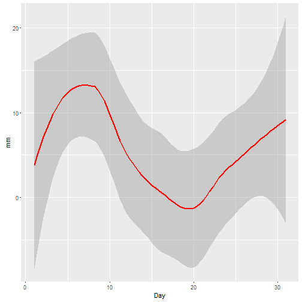

## Self Introduction


Hi! Nice to meet you. My name is Safuan, and I am working as an executive in a Malaysian's telecommuncation company.

I an interested in database administrator, network administrator, clustered programming and data analytics.


--- .class #id 

## Project

This current project is my submission for the Assignment of Developing Data Product, a Module in the Data Science series in CoursEra OnLine Education Learning.

I've prepared the plot of the rainfall for Kuala Lumpur International Airport (KLIA) from the years of 2008-2014, for the 1st part of this Data Science Module - using shiny apps and package. You can view this here using this link: https://sapong.shinyapps.io/Assignment/ 

Now for the 2nd half of the Assignment; the Reproducible Pitch Presentation, i will be using slidify apps & package. 

--- .class #id 

## Data Preparation.

The data itself was taken from the the Malaysian's Government website data.gov.my, in the catalogue tab under the purview of Ministry of Science, Technology and Innovation. From there we can obtain the Kuala Lumpur International Airport (KLIA) Rainfall Index in the year 2008-2014, to view how much is the daily rainfall amount for a particular day. The data needs a bit of tidying up, whereby we have omitted the non-data portion (titles, notes, remarks) as well as replacing defective values with the number 0. We ended up with this tidy dataset.


```r
klia <- read.csv("Rainfall_Wind_KLIA_2008_2014.csv")
head(klia,4)
```

```
##   Stnno Year Month Day Rainfall Day.mean.wind Solar.Radioation...MJm.2.
## 1 48650 2008     1   1      0.0           2.9                     16.70
## 2 48650 2008     1   2      0.0           2.5                     15.48
## 3 48650 2008     1   3      0.0           2.6                      9.82
## 4 48650 2008     1   4     14.4           1.9                     14.86
```

--- .class #id 

## Plotting the Result
Finally, let's plot one instance of the rainfall for 2008 in the month of January: (remember you have have a full dataset view @ https://sapong.shinyapps.io/Assignment/).


